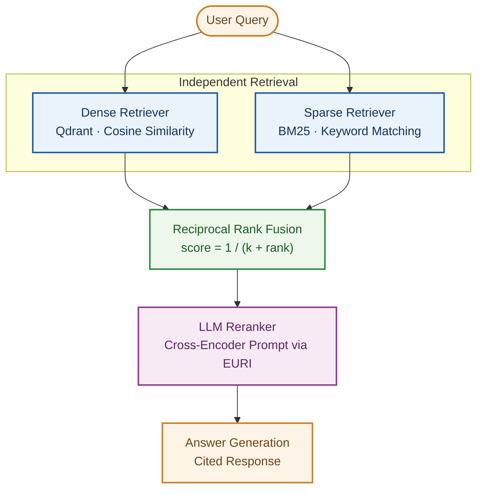

# ReRankEval

A production-style hybrid retrieval pipeline for RAG: **Dense Vector Search + BM25 Sparse Search → Reciprocal Rank Fusion (RRF) → LLM Reranking → Answer Generation.**

## 1. Project Description

ReRankEval builds and evaluates a hybrid retrieval pipeline for RAG. Instead of relying on a single retrieval method, it runs dense vector search and BM25 keyword search independently, fuses their results with Reciprocal Rank Fusion, and reorders the fused shortlist with an LLM-based reranker before generating a final, cited answer. The project compares this full pipeline against three simpler baselines — Vector Only, BM25 Only, and Hybrid without reranking — using a hand-verified evaluation set built from five real-world financial and payments documents.

## 2. Introduction to Evals, Reranking, and RRF

**Reranking** is a second retrieval pass. Dense and sparse search both hand back a ranked list based on their own scoring — cosine similarity for dense, keyword overlap for BM25 — but neither actually reads the query and a candidate chunk together before ranking them. A reranker does: it takes a shortlist of candidates and asks a model to judge each one's relevance to the query directly, then reorders by that judgment.

**Reciprocal Rank Fusion (RRF)** is how two independently ranked lists get combined into one. Cosine similarity scores and BM25 scores aren't on comparable scales — a 0.91 from one and a 12.4 from the other mean nothing side by side — so RRF ignores the raw scores entirely and uses only each chunk's *rank position* in each list:

```
RRF_score(chunk) = 1 / (k + rank_in_dense_list) + 1 / (k + rank_in_sparse_list)
```

A chunk ranked highly in either list gets a high combined score; a chunk found by both retrievers gets boosted further.

**Evals** are how retrieval quality gets measured with numbers instead of a gut feeling. This project uses three: **Hit Rate** (did we retrieve at least one relevant chunk at all), **MRR** (how quickly does the first relevant chunk show up), and **NDCG** (are the most relevant chunks placed near the top of the ranking). Together they cover both "did retrieval find the right answer" and "was it ranked well" — which is exactly what's needed to tell whether fusion and reranking are actually helping.

## 3. Why Are We Doing This?

Dense and sparse retrieval each have a blind spot. Dense search is good at meaning — it matches "refund" and "money back" even when the wording differs — but blurs past exact terms like a specific requirement number or a product code. BM25 is the opposite: exact keyword matches are its strength, but it has no notion of meaning when the wording changes. Real queries need both, and no single query announces in advance which one it needs.

Combining the two, then reranking the combination, is a common claim in RAG system design — but a claim isn't the same as evidence. This project exists to actually test it: build all four variants, run them against the same real documents and the same test queries, and let the Hit Rate / MRR / NDCG numbers say whether hybrid retrieval and reranking genuinely retrieve better, rather than asserting that they do.

## 4. Architecture Diagram



Dense and sparse retrieval run **independently** — neither sees the other's results. Fusion and reranking are separate, sequential steps: RRF combines by rank position alone, then the reranker re-judges the fused shortlist by actually reading each chunk against the query.

## 5. Final Results

Ten hand-verified test queries, run against all four variants, scored on Hit Rate, MRR, and NDCG:

| Variant                | Hit Rate | MRR       | NDCG      |
|-------------------------|---------:|----------:|----------:|
| Vector Only             |    0.700 |     0.567 |     0.619 |
| BM25 Only               |    0.900 |     0.645 |     0.708 |
| Hybrid (RRF)            |    0.800 |     0.583 |     0.595 |
| **Hybrid + Reranking**  | **1.000**|  **0.800**|  **0.845**|

**Hybrid + Reranking wins on every metric**, with a perfect Hit Rate across all 10 queries.

One result worth calling out rather than hiding: **plain Hybrid (RRF, no reranking) scored *worse* than BM25 alone** on this test set — RRF's position-based fusion can dilute a strong single retriever's ranking rather than improve it. Reranking is what recovers that loss: per-query inspection shows the reranker correctly promoting a chunk that RRF had buried, on more than one query. See `eval/run_comparison.py`'s per-query output for the full breakdown.

The 10-query test set is intentionally small, given the LLM-call cost of `Hybrid + Reranking`; these results should be read as directionally strong rather than statistically definitive.

## 6. Corpus

Five real-world financial/payments documents (1,507 chunks total after ingestion):

| File | Publisher | Type |
|---|---|---|
| `enhancing-cross-border-payments-building-blocks-global-roadmap.pdf` | CPMI / FSB | Roadmap report |
| `Payment-methods-guide.pdf` | Stripe | Guide |
| `payment-services-electronic-money-approach.pdf` | FCA | Regulatory approach document |
| `PCIDSS_QRGv3.pdf` | PCI Security Standards Council | Quick reference guide |
| `principles-financial-market-infrastructures.pdf` | CPMI-IOSCO | Principles / standards document |

## 7. Project Structure

```
ReRankEval/
├── data/
│   ├── manifest.json
│   ├── *.pdf                      # the 5 source documents
│   └── bm25_index.pkl             # generated by ingest.py, not committed
├── eval/
│   ├── __init__.py
│   ├── test_queries.py            # 10 ground-truth queries, page-verified via pdfplumber
│   ├── metrics.py                 # Hit Rate, MRR, NDCG
│   └── run_comparison.py          # runs all 4 variants, prints the comparison table
├── rag/
│   ├── __init__.py
│   ├── chat_model.py              # EuriChatModel — shared LLM client
│   ├── embedding.py               # EuriEmbedder — shared embedding client
│   ├── vector_store.py            # dense retrieval (Qdrant)
│   ├── sparse_retriever.py        # sparse retrieval (BM25)
│   ├── fusion.py                  # Reciprocal Rank Fusion
│   ├── reranker.py                # LLM-based reranking
│   ├── pipeline.py                # the 4 variants: vector_only, bm25_only, hybrid, hybrid_reranked
│   ├── generate.py                # end-to-end answer generation
│   └── ingest.py                  # builds both indexes from data/
├── tests/
│   ├── __init__.py
│   └── test_connection.py         # smoke test for EURI connectivity
├── .env.example
├── .gitignore                     # excludes .venv/, .env, __pycache__/, data/bm25_index.pkl
├── requirements.txt
└── README.md
```

## 8. Setup

**Requirements:** Python 3.10+, a Qdrant instance (cloud or local), an EURI API key.

```bash
git clone <repo-url>
cd ReRankEval
python -m venv .venv
source .venv/bin/activate        # .venv\Scripts\activate on Windows
pip install -r requirements.txt
```

Copy `.env.example` to `.env` and fill in:

```
EURI_API_KEY=
EURI_BASE_URL=
EURI_EMBED_MODEL=
CHAT_MODEL=
QDRANT_URL=
QDRANT_API_KEY=
QDRANT_COLLECTION=
```

## 9. Running It

**1. Ingest the corpus** (builds both the Qdrant collection and the BM25 index):
```bash
python -m rag.ingest
```

**2. Run the four-variant comparison:**
```bash
python -m eval.run_comparison
```
Prints per-query hit/miss/rank for each variant, then the final comparison table. Note: `Hybrid + Reranking` fires ~10 LLM calls per query (`candidate_k=10`), so a full run takes several minutes, not seconds.

**3. Ask a question end-to-end:**
```bash
python -m rag.generate
```
Uses the winning variant (`hybrid_reranked`) for retrieval, then generates a cited answer.

## 10. Key Design Decisions

- **RRF, not raw score blending** — cosine similarity and BM25 scores aren't on comparable scales, so fusion uses each chunk's *rank position* in each list (`1 / (k + rank)`, k=60) rather than the scores themselves.
- **`candidate_k` vs `top_k`** — dense and sparse each contribute a wider pool (`candidate_k=10`) into fusion and reranking, narrowed to the final `top_k=5` only at the very last step, so RRF and the reranker have real material to work with rather than an already-narrowed list.
- **Reranker is a prompt, not a separate library** — scores each chunk 0–10 via the same EURI chat model used elsewhere in this project, for consistency and to avoid an extra dependency.
- **Ground truth keyed by `(source, page)`, not chunk id** — `ingest.py` generates fresh random UUIDs on every run, so ids aren't stable across re-ingestion; source file + page number is.
- **A known text-extraction quirk was left unfixed, deliberately** — one source PDF (`payment-services-electronic-money-approach.pdf`) has a `pdfplumber` quirk where word spaces render as a `\x07` control character. Verified this doesn't affect BM25 tokenization or retrieval quality — per-query results show it retrieving correctly regardless — so no cleanup was applied.

## 11. Links

- GitHub repository: https://github.com/saurabhkamal/Hybrid-Search-RRF-Reranking-System
- YouTube walkthrough: coming soon
- Connect on LinkedIn: https://www.linkedin.com/in/saurabh-kamal/
